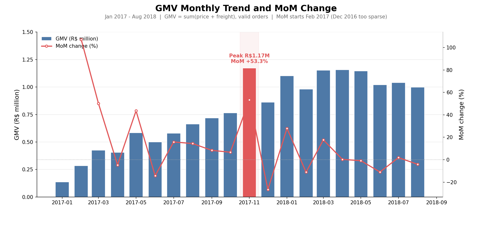
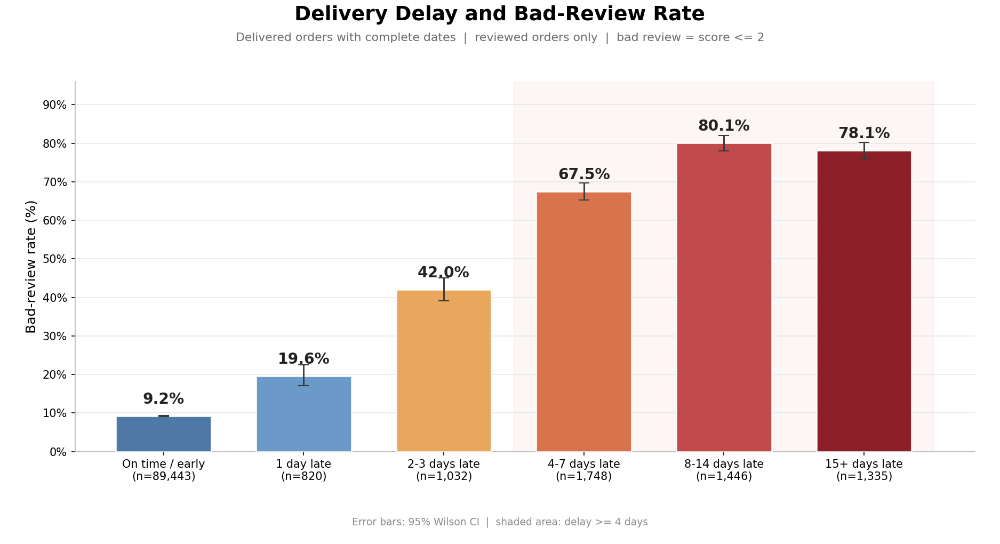

# Olist 电商经营分析

基于巴西 Olist 电商公开数据（约 9.9 万订单）完成的经营分析项目：MySQL 多表取数、SQL 业务分析、Pandas 交叉复核、图表与业务 memo。

English: An e-commerce analytics project built on the public Brazilian Olist dataset (~99K orders), covering MySQL schema design, 8+ SQL business analyses, Python cross-validation, and data-driven recommendations.

   

---

## 关键数字

| 指标 | 结果 | 口径一句话 |
|---|---:|---|
| 订单总数 | 99,441 | orders 表全量订单 |
| 有效订单量 | 98,199 | 有商品明细且非取消/不可用 |
| 有效买家数 | 94,983 | 按 customer_unique_id 去重 |
| GMV | R$15,735,527.03 | items 口径：price + freight |
| 客单价 AOV | R$160.24 | GMV / 有效订单量 |
| 复购率 | 3.04% | 全周期购买 ≥2 单客户占比 |
| Cohort 第 1 月加权留存 | 0.45% | 首购月客群次月回访占比 |
| 送达率 | 97.02% | delivered / orders 全量 |
| 延迟率 | 6.77% | 晚于承诺时间的已送达订单 |

---

## 核心发现

**1. 配送延迟与差评高度相关**

差评率（score ≤ 2）从按时送达的 9.22%，升至延迟 8–14 天的 80.08%；95% Wilson 置信区间各层不重叠。

**2. 复购率极低，高价值客户正在流失**

96.96% 的客户全周期只买 1 单；“高价值流失风险”层 20,922 人仅占客户 22.03%，却贡献 30.12% 的 GMV。

**3. 需求端区域集中，供给端长尾**

买家 GMV 中 SP 州占 37.36%、Top5 州合计 73.14%；而 3,053 个卖家中 Top20 仅占 20.92%。

**4. 头部品类存在“高销量低评分”洼地**

Top10 品类合计贡献 62.33% GMV；bed_bath_table 销量最高，但平均评分在 Top10 中最低（3.98）。

**5. 大促脉冲显著**

GMV 月度峰值出现在 2017-11（R$1,172,191.68，环比 +53.28%），符合 Black Friday 促销节奏。

---

## 图表

GMV 月度趋势与环比（环比自 2017-02 起展示，避免稀疏月份失真）：



配送延迟与差评率（含 95% Wilson CI）：



---

## 项目流程

```text
9 张原始 CSV
  -> MySQL 建库导表
  -> 9 个 SQL 分析脚本（01-08 必做 + 09 可选）
  -> results/ 导出 CSV 与 PNG
  -> Pandas 独立复核关键指标
  -> docs/ 口径表 + 业务 memo
```

## 技术栈

| 层 | 使用 |
|---|---|
| 数据库 | MySQL 8（utf8mb4、主键/索引、LOAD DATA 导入） |
| SQL | 多表 JOIN、CASE WHEN、日期函数、CTE、窗口函数 |
| Python | Pandas、Statsmodels、Matplotlib、PyMySQL |
| 统计 | 95% Wilson 置信区间、指标交叉验证 |
| 协作 | Git / GitHub、requirements.txt |

## 仓库结构

```text
olist-project/
├── data/        # 9 张原始 CSV
├── sql/         # 00 建表导入；01-09 业务分析 SQL
├── analysis/    # Python 数据质量、交叉复核、专题、绘图
├── results/     # 全部结果 CSV 与 PNG
├── docs/        # 数据字典、口径表、业务 memo
├── requirements.txt
└── README.md
```

---

## 快速复现

前提：本机 MySQL 8 已启动，conda 环境 `ds_project` 已创建并安装 [requirements.txt](requirements.txt)。

```powershell
# 0) 进入项目目录并激活环境
cd E:\03_Development\DataAnalyst\olist-project
conda activate ds_project

# 1) 设置本次会话数据库密码（不要提交）
$env:MYSQL_PWD='你的MySQL密码'

# 2) 建库导表（PowerShell 不支持 < 输入重定向，故用 cmd 包装）
cmd /c '""E:\03_Development\MySQL\mysql-8.0.46-winx64\bin\mysql.exe" --local-infile=1 --default-character-set=utf8mb4 -h 127.0.0.1 -P 3306 -u root < "sql\00_建表导入.sql""'

# 3) 导入核对 + 一键重跑 SQL 01-09
python analysis/import_qc.py
python analysis/run_all_sql.py

# 4) Python 数据质量 / 交叉复核 / 专题
python analysis/01_数据质量.py
python analysis/02_关键指标复核.py
python analysis/03_专题分析.py

# 5) 出图
python analysis/02_plot_trend.py
python analysis/03_plot_delay.py
```

复现核对：重跑后 `results/` 应与仓库基线完全一致，可执行 `git diff -- results` 验证。

---

## 文档

- [数据字典](docs/数据字典.md)：9 张表的字段、行数与主键检查
- [口径表](docs/口径表.md)：每个指标的分子、分母、时间窗与剔除规则
- [业务结论文档](docs/业务结论文档.md)：发现、归因、建议与验证

## 数据来源与许可

数据来源：[Kaggle · Brazilian E-Commerce Public Dataset by Olist](https://www.kaggle.com/datasets/olistbr/brazilian-ecommerce)。

数据集页面未标注明确 License；本仓库仅用于学习与展示，公开再分发请保留来源与归属。

## 局限与边界

- 巴西市场数据：分析方法可迁移，具体数值不直接照搬到中国市场。
- 结论基于相关与分层差异，不构成因果推断。
- 评价正文缺失率较高，但评分字段覆盖完整。
- 数据首尾月份样本稀疏，趋势结论以 2017-01 ~ 2018-08 为核心期。
