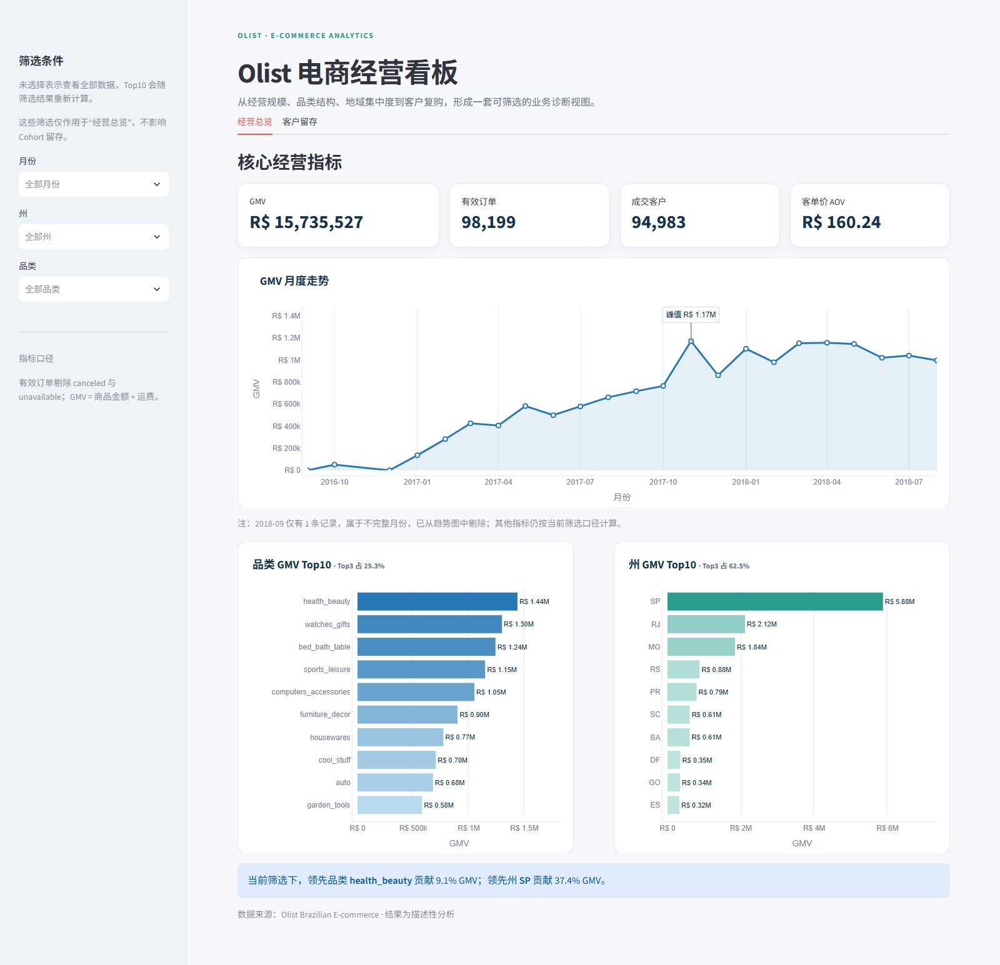
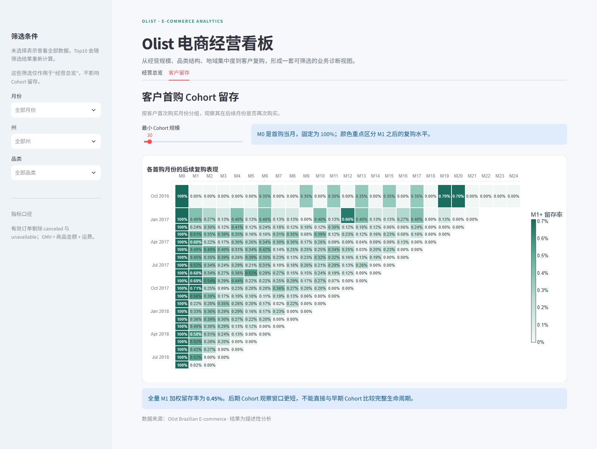
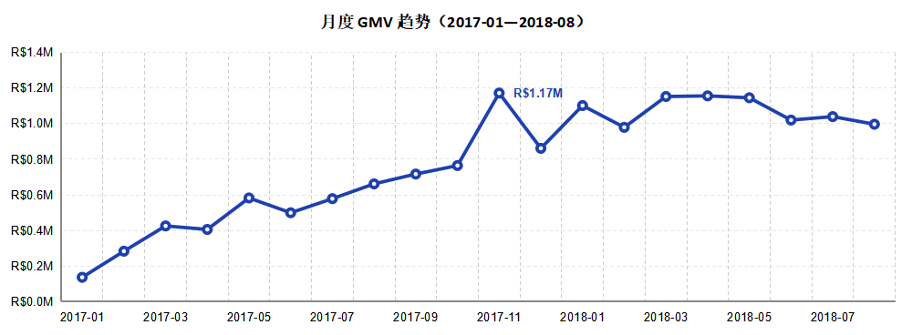
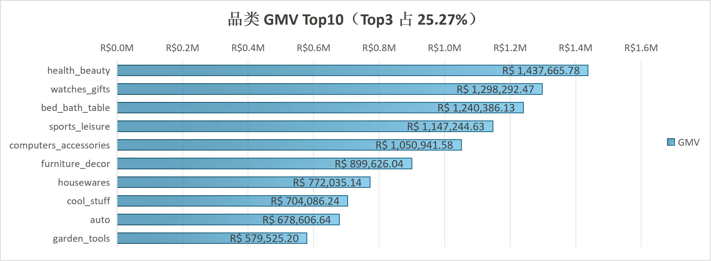
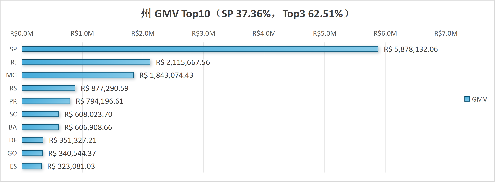
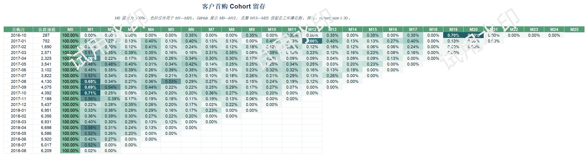

# Olist 电商经营分析与交互式 BI 看板

基于巴西 Olist 公开订单数据完成的端到端数据分析项目：从 MySQL 建库、SQL 业务分析和 Pandas 交叉验证，延伸到 Excel 报表、Streamlit + Plotly 交互看板及在线发布。

[在线体验 Streamlit 看板](https://olist-business-dashboard.streamlit.app/) · [下载 Excel 看板](workbook/Olist电商经营看板_Excel优化版.xlsx) · [查看完整复现手册](docs/项目A完整操作说明.md)

## 项目概览

```text
9 张原始 CSV
  → MySQL 建库与多表分析
  → Pandas 独立复核关键指标
  → 20 项数据质量检查
  → Excel 经营报表
  → Streamlit + Plotly 交互看板
  → GitHub 与在线部署
```

看板支持按月份、州和品类筛选，并在当前筛选范围内重新计算 KPI 与 Top10；客户留存页独立展示首购 Cohort 的后续回访情况。

## 核心指标

| 指标 | 结果 | 口径 |
|---|---:|---|
| 有效订单 | 98,199 | 有商品明细且剔除 canceled、unavailable |
| 成交客户 | 94,983 | 按 customer_unique_id 去重 |
| GMV | R$15,735,527.03 | 商品金额 + 运费 |
| 客单价 AOV | R$160.24 | GMV / 有效订单 |
| 复购率 | 3.04% | 全周期购买不少于 2 单的客户占比 |
| Cohort M1 加权留存 | 0.45% | 首购后第 1 月再次购买 |

SQL 与 Pandas 对 GMV、成交客户、复购率和 Cohort 留存进行了独立复算，关键结果一致；BI 事实表通过 20/20 项自动 QC。

## 关键发现

- 延迟履约与差评明显相关：按时送达订单差评率为 9.22%，延迟 8–14 天升至 80.08%。
- 客户复购偏弱：复购率仅 3.04%，高价值流失风险客户贡献 30.12% GMV。
- 地域集中明显：SP 州贡献 37.36% GMV，Top5 州合计贡献 73.14%。
- 品类头部效应突出：品类 GMV Top10 合计贡献 62.33%，其中 health_beauty 位居第一。
- 2017 年 11 月 GMV 达到 R$1.17M，环比增长 53.28%，呈现明显促销峰值。

以上均为描述性分析与相关性发现，不解释为因果效应。

## Streamlit 看板

### 经营总览



### 客户 Cohort 留存



## Excel 看板

### 月度 GMV 趋势



| 品类 GMV Top10 | 州 GMV Top10 |
|---|---|
|  |  |

### 客户首购 Cohort 留存



## 仓库结构

```text
olist-ecommerce-analysis/
├── sql/                    # 建库、导入与 9 组业务分析 SQL
├── analysis/               # 数据质量、Python 复核、专题分析与出图
├── data/                   # 9 张 Olist 原始 CSV
├── results/                # SQL/Python 冻结结果
├── dashboard/              # Streamlit、Plotly、派生数据、QC 与测试
├── workbook/               # Excel 优化版经营看板
├── screenshots/dashboard/  # Excel 与 Streamlit 展示图
└── docs/                   # 数据字典、指标口径、业务结论与复现说明
```

## 快速运行看板

```powershell
cd E:\03_Development\DataAnalyst\olist-project
python -m pip install -r requirements.txt
python -m streamlit run dashboard/app.py
```

浏览器打开 `http://localhost:8501`。也可以直接访问[在线版本](https://olist-business-dashboard.streamlit.app/)。

## 重新生成并验证 BI 数据

没有 MySQL 凭据时，可从仓库内冻结的原始 CSV 重新生成：

```powershell
python dashboard/prep/make_c_data.py --source csv
python dashboard/prep/qc_c_data.py
python -m pytest dashboard/tests/test_dashboard_logic.py -q
```

正式 MySQL 路径：

```powershell
$env:MYSQL_PWD = '你的本机 MySQL 密码'
python dashboard/prep/make_c_data.py --source mysql
python dashboard/prep/qc_c_data.py
Remove-Item Env:MYSQL_PWD
```

QC 任一检查失败都会返回非 0，不应继续发布看板。完整的建库、SQL、Python 与结果复现步骤见[项目完整操作说明](docs/项目A完整操作说明.md)。

## 文档

- [数据字典](docs/数据字典.md)
- [统一指标口径](docs/口径表.md)
- [业务结论](docs/业务结论文档.md)
- [BI 数据 QC 记录](docs/dashboard/第1天_QC结果.md)
- [Excel 与 Streamlit 看板说明](docs/dashboard/第2天_双版本看板说明.md)
- [口径与面试自测](docs/dashboard/口径与面试自测.md)

## 技术栈

MySQL 8 · SQL · Python · Pandas · Statsmodels · Matplotlib · Excel · Streamlit · Plotly · Git/GitHub

## 数据来源与边界

数据来源：[Kaggle · Brazilian E-Commerce Public Dataset by Olist](https://www.kaggle.com/datasets/olistbr/brazilian-ecommerce)。本项目用于学习与作品集展示；分析方法可以迁移，但巴西市场的具体结论不应直接外推到其他市场。
